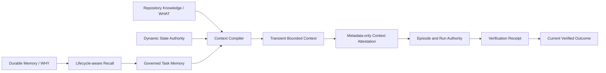

<p align="center">
  
</p>

<h1 align="center">Agent Memory Bridge</h1>

<p align="center"><strong>Carry project decisions into the next coding session.</strong></p>

<p align="center">
  AMB helps coding agents remember the decisions that matter — across sessions, tools, and time.
</p>

<p align="center"><a href="README.zh-CN.md">简体中文</a></p>

<p align="center">
  <a href="https://pypi.org/project/agent-memory-bridge/"></a>
  <a href="https://modelcontextprotocol.io"></a>
  <a href="https://github.com/zzhang82/Agent-Memory-Bridge/actions/workflows/ci.yml"></a>
  <a href="https://github.com/zzhang82/Agent-Memory-Bridge/releases"></a>
  <a href="LICENSE"></a>
  <a href="pyproject.toml"></a>
</p>

```bash
pip install agent-memory-bridge
```

Connecting a specific coding client is outside AMB Core. AMB does not discover, write, or certify Codex, Claude, Cursor, OpenCode, Hermes, Cline, VS Code, or Antigravity. Clients configure AMB as a standard MCP stdio server independently, pointing to the same local AMB home when they share project memory. See [Integrations](docs/INTEGRATIONS.md) for the generic installer and registration contract.

If an existing bridge lives at `~/.codex/mem-bridge`, v0.36 does not open it automatically. Set `AGENT_MEMORY_BRIDGE_HOME` to that directory, or copy it to `~/.local/share/agent-memory-bridge`. The [configuration guide](docs/CONFIGURATION.md) has the exact cutover.

## Your project should not start over with every session

A project is more than its current files. Over time, useful context gets scattered across repositories, chats, coding agents, reviews, fixes, and one-off decisions. A new session can see the code but still miss the reasons that make the project make sense.

AMB gives those decisions a durable place to live. The first win is simple: teach one real decision, close the session, open a fresh coding-agent session, and hear the same decision come back from AMB.

| Without shared project memory | With AMB |
|---|---|
| Each session reconstructs context | Useful project knowledge carries forward |
| Decisions disappear into old chats | Explicit decisions and reasons stay with the project |
| Different tools build different partial pictures | Supported MCP clients can use the same configured local AMB home |
| Memory can become stale or ambiguous | Provenance, revision, supersession, and inspection keep it governable |

AMB is local-first and inspectable. It does not silently archive every conversation or treat every remembered statement as equal authority.

## Quick Start

AMB requires **Python 3.11+**, Git, and an MCP-compatible coding client that can launch a local stdio server.

Current package/source version: `0.36.0`.

Published releases: see [GitHub Releases](https://github.com/zzhang82/Agent-Memory-Bridge/releases).

The product story is four steps: install AMB, initialize or resolve a project, run the generic MCP server, and use or inspect memory. Client connection stays outside Core.

### 1. Install AMB

Use a virtual environment so the MCP server points at one stable Python launcher. Replace `<venv-python>` with the Python executable inside `.amb-venv` for your operating system.

```bash
python -m venv .amb-venv
<venv-python> -m pip install agent-memory-bridge==0.36.0
```

For development or audit work against an exact source checkout, use:

```bash
<venv-python> -m pip install -e .
```

### 2. Initialize or resolve the project

```bash
<venv-python> -m agent_mem_bridge project init .
```

Project Init detects the local Git repository, proposes a namespace such as `project:my-app`, and waits for confirmation. It then derives a current repository baseline. It does not automatically learn decisions. Once bound, `project resolve .` can resolve the namespace for the checkout without reinitializing.

### 3. Run the generic MCP server

Run AMB as a standard MCP stdio server: command `<venv-python>`, arguments `-m agent_mem_bridge`, and a persistent `AGENT_MEMORY_BRIDGE_HOME` shared by any client accessing the project memory.

How a client launches that process is outside Core. The command shape is in [Integrations](docs/INTEGRATIONS.md).

Connection is verified when the client lists AMB's standard MCP tools such as `store` and `recall`. Health checks like `doctor` and `verify` test server prerequisites, not external client configuration loading.

### 4. Use or inspect memory

Teach an explicit project decision through the connected client using AMB's public `store` tool:

> Remember that we merge pull requests only after CI is green on the target branch, because broken main blocked two releases this month.

The agent stores the explicit decision and reason under the project namespace. AMB does not infer decisions from code or archive conversational transcripts.

In a fresh session against the same project and AMB home, ask:

> What is required before we merge a pull request?

The new session answers with the stored decision and reason because AMB recalled it. Seeing the decision in CLI Explore or Inspect is useful review, not the success check.

Historical Codex observations from the v0.35 line are documented in [First-win acceptance](docs/FIRST-WIN-ACCEPTANCE.md).

## After the first win

Once one decision survives a fresh session, you can inspect what AMB knows, keep repository facts current, and use the governance model below.

<details>
<summary>Optional review, refresh, and troubleshooting</summary>

Human-first Explore answers “What does AMB currently know about this project?” Inspect answers “Why did this information surface for this question?” Both are local and read-only.

```bash
<venv-python> -m agent_mem_bridge explore \
  --namespace project:my-app

<venv-python> -m agent_mem_bridge inspect \
  --namespace project:my-app \
  --query "What is required before we merge a pull request?"
```

This is a conceptual view, not verbatim CLI output:

```text
CODE / WHAT                     CONVERSATION / WHY
────────────────────            ──────────────────────────
Runtime: Python >=3.11          Decision: Merge only after
Package: my-app                 CI is green
Tests: pytest                   Reason: broken main blocked
                                two releases
```

**Code tells AMB WHAT the project is.**

**Conversations teach AMB WHY it is that way.**

That distinction is a trust boundary: derived facts can be rebuilt from current code, while durable project knowledge remains explicit, reviewable, and governed.

Repository WHAT comes from a clean Git commit. If HEAD changes or the worktree is dirty, AMB will not present an old snapshot as current truth. Refresh is not automatic. Rerun the explicit primitive:

```bash
<venv-python> -m agent_mem_bridge bootstrap-repo . \
  --namespace project:<name>
```

Refreshing repository WHAT leaves durable project WHY unchanged. Explore is CLI-only, not MCP tool #18, and it does not rank context for the model.

`first-run` remains optional guided help; it is not the first-win path:

```bash
<venv-python> -m agent_mem_bridge first-run --namespace project:my-app --query "What should I remember?"
```

Use health checks only when the connection is uncertain. They do not prove that a coding client loaded MCP config:

```bash
<venv-python> -m agent_mem_bridge doctor
<venv-python> -m agent_mem_bridge verify
```

</details>

## Integrations

AMB runs as a generic local stdio MCP server. Client connection is outside Core. The command shape, project initialization, lifecycle-hook input, and server checks are in [Integrations](docs/INTEGRATIONS.md).

## Why the memory stays trustworthy

The useful part of long-lived project memory is not simply remembering more. It is being able to tell where knowledge came from, whether it is still current, and how it changed.

AMB therefore keeps several boundaries explicit:

| Memory concern | AMB approach |
|---|---|
| Current repository truth | Derived from a clean repository state and refreshed explicitly |
| Human decisions and constraints | Stored explicitly as governed durable memory |
| Changed knowledge | Revised or superseded instead of silently overwritten |
| Why context surfaced | Inspectable through local derived views and evidence paths |
| Cross-session reuse | Shared through the same configured local AMB home |
| Privacy | Local-first; no hosted memory service is required |

This is where the earlier **WHAT / WHY** model belongs: it explains one of the mechanisms that keeps memory trustworthy, rather than defining the entire product.

## What AMB is — and is not

AMB is a governed local project-memory layer for coding agents. It is designed to preserve useful context across sessions and tools while keeping durable knowledge, derived repository facts, provenance, and corrections distinguishable.

It is not a transcript archive, a promise that an agent will remember everything, or a system that silently converts every conversation into durable truth. There is no automatic learning.

## Want the details?

| Read | For |
|---|---|
| [First-win acceptance](docs/FIRST-WIN-ACCEPTANCE.md) | Historical Codex observation from the v0.35 line |
| [Architecture](docs/ARCHITECTURE.md) | System shape and data flow |
| [Authority model](docs/AUTHORITY-CONTRACT.md) | Durable authority, derived views, correction, and audit rules |
| [Knowledge Explorer](docs/KNOWLEDGE-EXPLORER.md) | Human-first read-only project view |
| [Production Status](docs/PRODUCTION-STATUS.md) | Current implementation facts, evidence, and known limits |
| [Integrations](docs/INTEGRATIONS.md) | Generic stdio MCP installer contract |
| [Install for Agents](INSTALL_FOR_AGENTS.md) | Full install-to-first-success workflow |
| [Configuration](docs/CONFIGURATION.md) | Complete configuration reference |
| [Examples](examples/README.md) | Sanitized demos and artifacts |

## Technical model

The product story above intentionally postpones implementation vocabulary. Internally, AMB keeps `derived_repository` data separate from governed durable memory so one cannot silently become the other. For maintainers and reviewers, the current authority flow is:



SQLite/WAL rows are durable authority. Repository snapshots, FTS rows, embedding sidecars, compiled context, reports, and Explorer views are derived. Context bodies are rendered in process and are not durably persisted by the compiler.

## Trust and privacy

AMB is local-first. It does not require a hosted memory service. It separates durable memory from coordination Signals and mutable Dynamic State, keeps provenance visible, and rejects raw transcripts, hidden reasoning, and inline artifact bodies from the durable episode path.

Read the [Trust Boundary](docs/TRUST-BOUNDARY.md), [Authority Contract](docs/AUTHORITY-CONTRACT.md), and [Closed-Loop Episode Authority](docs/CLOSED-LOOP-EPISODE.md) for the exact boundaries.

## MCP Tools

AMB exposes **17 public MCP tools**:

- `store`, `recall`, `browse`, and `stats`
- `forget`, `feedback`, `promote`, `annotate`, `revise`, and `export`
- `begin_run`, `record_run_event`, `get_run`, and `complete_run`
- `claim_signal`, `extend_signal_lease`, and `ack_signal`

The public tool surface stays small. Setup, Project Init, Explore, Inspect, context assembly, and review reports remain CLI or internal derived workflows rather than becoming more MCP tools.

The local protocol cache contract is `300000/public` for discovery and `0/private` for the tool list; see [MCP Compatibility](docs/MCP-2026-COMPATIBILITY.md) for details.

## Current maturity

Current package/source version is `0.36.0`. Schema remains v12 and the public MCP surface remains exactly 17 tools. There is no automatic learning and no MCP tool #18. `project init` is the preferred first-project path. Default Explore is a Human-first view over existing repository-derived context and governed project knowledge. Current evidence and non-claims live in [Production Status](docs/PRODUCTION-STATUS.md); published artifacts live in [GitHub Releases](https://github.com/zzhang82/Agent-Memory-Bridge/releases).

## Contributing

Read [CONTRIBUTING.md](CONTRIBUTING.md) for development and public-surface expectations, and [SECURITY.md](SECURITY.md) for vulnerability reporting.

Licensed under [MIT](LICENSE).
